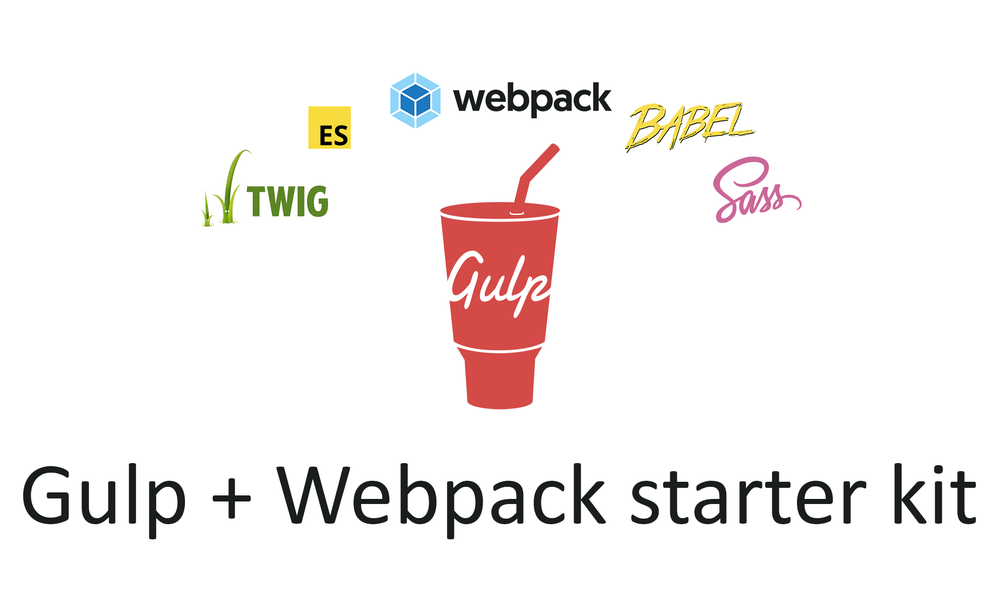

# Gulp + Webpack starter kit - Окружение для разработки веб-проектов
Современный стартовый инструментарий для веб-разработки с использованием Gulp Task Runner и Webpack bundler.

Идеально подходит для быстрой сборки статических HTML сайтов или верстки. 

Все задачи выполняются через Gulp. Webpack используется только для сборки Javascript (особенно для ES6 Import/Export, так как Gulp не может сделать это надлежащим образом).



## Требования к окружению
Для создания окружения необходимо иметь следующие установленные инструменты:
-	node.js
-   npm
-	git
-	gulp
-   webpack

Если у вас данных инструментов нет, то их необходимо установить.

Также рекомендуется вместо `npm` использовать `yarn`, синтаксис не особо отличается, но зато прирост в скорости установки пакетов ощутимо заметен.

## Установка

### 1. Клонирование
Скачайте файлы с github или клонируйте его c помощью команды:

```bash
git clone https://github.com/alexsoin/gw-starter-kit.git
```

### 2. Установки зависимостей проекта
Для установки зависимостей проекта необходимо в командной строке ввести команды:
```bash
npm install
```

Если требуются дополнительные пакеты, то для их установки нужно выполнить команду:

- Установка пакета, при этом информация о нём, автоматически прописывается в секцию "devDependencies" файла "package.json" *(такие пакеты как gulp-autoprefixer)*
```bash
npm install название_пакета --save-dev
```

- Установка пакета, при этом информация о нём, автоматически прописывается в секцию "dependencies" файла "package.json" *(такие пакеты как bootstrap)*
```bash
npm install название_пакета --save-prod
```

### 3. Правка информации о новом проекте

1. Переходим в клонированную директорию
2. Удаляем папку `.git`
3. Редактируем файл `package.json`, меняем в нем параметры `name`, `description`, `author` и `repository.url` на свои значения.

## Как использовать окружение
**Режим живого сервера** 
- `npm run watch`       - сборка и запуск live-server в режиме developer 
- `npm run prodwatch`   - сборка и запуск live-server в режиме production        

**Режим сборки** 
- `npm run build`       - сборка проекта в режиме production 
- `npm run devbuild`    - сборка проекта в режиме developer       

**Выборочная сборка**: 
- `gulp templates`   - сборка html файлов
- `gulp styles`      - сборка css стилей
- `gulp scripts`     - сборка js скриптов
- `gulp fonts`       - сборка шрифтов
- `gulp images`      - сборка картинок
- `gulp clean`       - очистка папки конечной сборки

## Список инструментов

Окружение, предназначенное для разработки фронтенд проекта, построено на базе следующих инструментов:

- **Node.js** (среды, в которой будет выполняться окружение);
- **npm** (пакетного менеджера, входящего в Node.js; будет использоваться для загрузки Gulp, плагинов и фронтенд пакетов);
- **jQuery, Popover, Bootstrap** (пакеты, которые будут использоваться для сборки css и js частей сайта);
- **Gulp и его плагины** (будут использоваться для сборки проекта и выполнения других веб задач).
- **Webpack и его плагины** (будут использоваться для сборки js скриптов).

## Файловая структура Gulp проекта

### Корневая директория
В корне проекта расположены папки:

```bash
├── gulpfile.js                 # Конфигурация и задачи Gulpfile
├── package.json                # Зависимости и скрипты Node.js
├── README.md                   # Описание проекта
├── dist                        # Директория выгрузки проекта
├── src                         # Для исходных файлов
│   ├── assets                  # Хранятся стили, скрипты и тд
│   │   ├── fonts               # Для шрифтов
│   │   ├── img                 # Для изображений
│   │   ├── js                  # Для js-файлов
│   │   │   ├── vendor          # Здесь складываются все js файлы библиотек и зависимостей
│   │   │   │   └── import.js   # В import.js указываются импорты библиотек добавленных через npm
│   │   │   └── base.js         # Вы можете создать любое количество js файлов в этом каталоге. Они автоматически соберутся в один файл main.min.js
│   │   └── styles              # Для scss стилей
│   │       ├── main.scss       # Основной файл таблицы стилей
│   │       ├── base.scss       # Пользовательская таблица стилей
│   │       └── variables.scss  # Переменные таблиц стилей
│   ├── data                    # Хранятся json файлы для вывода данных при разработке
│   │   ├── dev.json            # json файл для вывода данных при develop разработке
│   │   ├── prod.jso            # json файл для вывода данных при production разработке
│   │   └── site.jso            # Общий json файл для вывода данных
│   └── views                   # Для фрагментов twig файлов
│       ├── base.twig           # Вы можете создать любое количество страниц в этом каталоге
│       ├── layout              # Хранятся шаблоны страницы
│       │   └── index.twig      # Вы можете создать любое количество шаблонов в этом каталоге
│       └── partials            # Хранятся части часто используемого кода на страницах
│           └── header.twig     # header сайта
└── webpack.config.js           # Настройки webpack
```

### Директория js

В директории `js` распологаются два файла: `main.js` и `my.js`. Файл `my.js` используется для написания своих скриптов, а 
`main.js` – для определения списка файлов, содержимое которых необходимо будет включить в итоговый js-файл. Под итоговым понимается файл, который должен получиться на выходе (в каталоге `build`).

### Директория style

Директория `style` отведена под стили. В данной директории находятся три файла: `main.scss` (содержит список файлов, содержимое которых необходимо включить в итоговый файл стилей), `my.scss` (используется для написания своих стилей) и `variables.scss` (содержит SCSS переменные, с помощью которых будем изменять стили Bootstrap 4, а также использовать его для создания своих переменных).

### Директория views и файл index.twig

Файл `index.twig` - это главная страница создаваемого проекта. Кроме `index.twig` в данную директорию можно поместить и другие twig файлы из которых будут созданы html страницы.

Директория `layout` предназначена для помещения в неё шаблонов страниц. 

Директория `partials` предназначена для помещения в неё фрагментов страниц. Это позволит более просто создавать и редактировать html страницы, т.к. отдельные части страниц уже будут находиться в отдельных файлах.

Чтобы при показе результата сборки не приходилось сбрасывать кеш браузера изза устаревших стилей в данной сборке присутствует версионирование. При запуске команды `build` в html файлах у подключаемых js и css добавляется их версия.

В данной сборке используется шаблонизатор twig.
